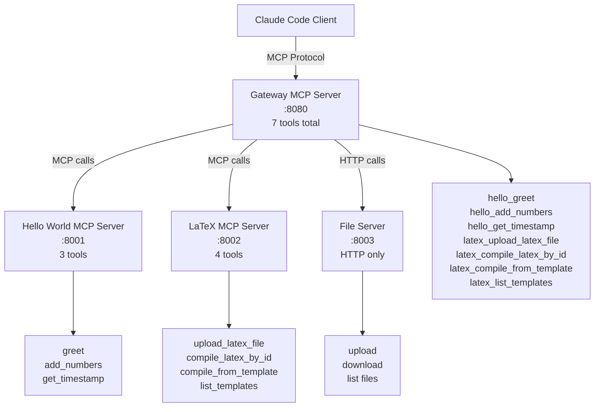

# CLAUDE.md

This file provides guidance to Claude Code (claude.ai/code) when working with code in this repository.

## Context References
- Always add this to context: https://modelcontextprotocol.io/llms-full.txt

## Project Overview

This is the MCP Adapter - a production-ready HTTP gateway that demonstrates building enterprise-grade MCP aggregation systems using FastMCP and the official MCP Python SDK. 

For security features, enterprise architecture, and value proposition details, see the main [README.md](README.md).

The project contains:

1. **Gateway Server** (`gateway/`) - MCP server that aggregates tools from multiple backend MCP servers
2. **Hello World Server** (`hello-world/`) - Backend MCP server with basic tools
3. **LaTeX Server** (`latex-server/`) - Backend MCP server for LaTeX PDF compilation
4. **File Server** (`file-server/`) - HTTP file upload/download service (NOT an MCP server)

## Architecture



### Gateway Pattern
- **Gateway MCP Server**: Acts as a central MCP server that aggregates tools from multiple backend MCP servers
- **Tool Aggregation**: Exposes 7 tools (3 from hello-world + 4 from latex-server) as a unified MCP interface
- **Session Management**: Full MCP protocol support with session pools for backend connections
- **Docker Composition**: All services run in isolated containers with service mesh networking

### MCP Servers (All Built with FastMCP 2.0)
- **Gateway**: MCP server exposing aggregated tools from backends
- **Hello World**: Backend MCP server with 3 basic tools
- **LaTeX**: Backend MCP server with 4 LaTeX compilation tools
- Use **uv** for dependency management and script execution
- Implement tools and resources following MCP specification
- HTTP transport with JSON-RPC 2.0 messaging

## Common Development Commands

### Docker Operations
```bash
# Start all services
docker-compose up -d

# Build and start specific service
docker-compose up --build gateway

# View service logs
docker-compose logs -f gateway
docker-compose logs -f hello-world  
docker-compose logs -f latex-server

# Stop all services
docker-compose down
```

### Testing
**IMPORTANT**: Do not run tests without first reading `tests/CLAUDE.md` for complete testing instructions and context.

```bash
# Run complete test suite
cd /Users/steven/code/mcp-adapter/tests && uv run pytest  # Use absolute path to avoid cd issues

# Individual server tests  
cd /Users/steven/code/mcp-adapter/hello-world && uv run pytest  # Test hello-world tools
cd /Users/steven/code/mcp-adapter/latex-server && uv run pytest  # Test latex tools

# Run specific test files
cd /Users/steven/code/mcp-adapter/tests && uv run pytest test_connectivity.py
cd /Users/steven/code/mcp-adapter/tests && uv run pytest test_session_management.py

# Run specific test methods
cd /Users/steven/code/mcp-adapter/tests && uv run pytest test_session_management.py::TestMCPSessionManagement::test_concurrent_mcp_sessions -v

# Alternative: Run from project root using pytest's file path syntax
uv run pytest tests/test_connectivity.py  # From project root
```

**Testing Workflow Notes**:
- Always use absolute paths when changing directories in testing commands
- Restart Docker services (`docker-compose down && docker-compose up -d`) after code changes
- Pre-commit hook automatically runs full test suite for safety
- Run `uv run pytest` manually to see current test status and coverage

For detailed testing documentation and coverage information, see `tests/CLAUDE.md`.

### Service URLs
- Gateway Dashboard: http://localhost:8080
- Gateway Session Monitor: http://localhost:8080/sessions  
- Hello World Server (MCP): http://localhost:8001
- LaTeX Server (MCP): http://localhost:8002
- File Server (HTTP only): http://localhost:8003

### Session Pool Monitoring
```bash
# View session pool statistics
curl http://localhost:8080/sessions | jq

# Monitor concurrent session usage in real-time
watch -n 2 'curl -s http://localhost:8080/sessions | jq .session_pools'

# Check session counts
curl -s http://localhost:8080/info | jq .session_pools
```

### Individual Service Development
```bash
# Run any server locally with uv
cd hello-world/
uv run hello_world.py

cd latex-server/
uv run server.py

cd gateway/
uv run gateway.py
```

### Development Workflow - Code Changes
**IMPORTANT**: When making changes to Python server code, Docker services must be restarted to pick up the changes:

```bash
# Stop services
docker-compose down

# Restart services with updated code
docker-compose up -d

# Verify services are running
docker-compose ps
```

This is required because:
- Docker containers run the Python code from when they were built
- Code changes don't automatically reload in the containerized environment  
- The gateway, hello-world, and latex-server all need restart after code modifications

### Environment Configuration
- Set environment variables in `.env` file
- Key variables: `LOG_LEVEL`, `DEBUG`, `SERVER_PORT`
- LaTeX server: `LATEX_COMPILER`, `LATEX_TIMEOUT`, `MAX_FILE_SIZE`

## Technical Details

### FastMCP Usage
- All servers use `#!/usr/bin/env -S uv run --script` shebang with inline dependencies
- **Python 3.12 is required** for all development, testing, and deployment. Do not use other versions.
- Tools defined with `@mcp.tool` decorator
- Resources defined with `@mcp.resource` decorator  
- HTTP transport with `mcp.run(transport="http")`

### FastMCP Tool Testing Architecture
**CRITICAL FOR UNIT TESTS**: Functions decorated with `@mcp.tool` become FunctionTool objects, not direct callables.

**Accessing FastMCP Tools in Tests**:
```python
# Wrong (causes TypeError: 'FunctionTool' object is not callable)
result = await server.compile_latex(request)

# Correct - access underlying function via tool registry
compile_tool = server.mcp.tools["compile_latex"]
result = await compile_tool.func(request)
```

**FastMCP Tool Registry Structure**:
- `server.mcp.tools` contains all registered tools as FunctionTool objects
- `tool.func` is the underlying async function
- Tool names in registry match the decorated function names
- Each tool has metadata accessible via `tool.name`, `tool.description`, etc.

**Unit Test Patterns for FastMCP**:
- Access tools via `server.mcp.tools["tool_name"].func(args)`
- Non-decorated helper functions can be called directly: `server.sanitize_filename()`, `server.extract_packages()`
- Mock at the right level - mock helper functions or tool responses, not the tool objects themselves

### Gateway Tool Aggregation
- **MCP Servers Only**: Gateway aggregates tools from MCP servers (hello-world, latex-server)
- **File Server**: NOT an MCP server - provides HTTP file upload/download endpoints only
- **Security Design**: Tools are hardcoded in the gateway using `@mcp.tool` decorators as part of the security model
- **Tool Count**: Gateway exposes exactly 7 MCP tools (3 from hello-world + 4 from latex-server)
- Prefixes tool names with server namespace (e.g., `hello_greet`, `latex_compile_latex`)
- Proxies tool calls to appropriate backend servers using session pools
- Provides unified dashboard at gateway root URL
- **Adding New MCP Servers**: When adding MCP servers to the gateway, their tools must be explicitly hardcoded in `gateway.py`

### Concurrent Session Management
- **Session Pools**: Each backend server has a dedicated session pool (max 10 sessions per server)
- **Automatic Session Allocation**: Incoming requests automatically get assigned available sessions
- **Session Reuse**: Sessions are reused across multiple requests to minimize overhead
- **Load Balancing**: Concurrent requests use different sessions, enabling true parallelism
- **Session Monitoring**: Real-time session pool statistics available at `/sessions` endpoint
- **Automatic Cleanup**: Background task removes expired or failed sessions (5-minute timeout)
- **Emergency Sessions**: Can exceed pool limits under high load to prevent request blocking

### LaTeX Server Features
- **File-based workflow**: Upload files once, compile multiple times with minimal token usage
- **Original tools**: Direct compilation from LaTeX content (high token usage)
- **New efficient tools**: `upload_latex_file`, `compile_latex_by_id`, `get_compilation_errors`
- Template-based compilation with Jinja2 variable substitution
- **Templates available**: `basic_resume`, `simple_document`, `us_map` (US map visualization with tikz)
- Package validation and security controls
- Async compilation with timeout protection
- PDF output management with configurable directories

### LaTeX Workflow Tools
- **`./latex-watch.py`**: File watcher for auto-compilation on changes
- **`./example_workflow.py`**: Demo of token-efficient workflow (87% reduction)
- **Integration tests**: `tests/integration/` for complete workflow testing

## Server Configuration

The gateway discovers backend servers from `gateway/servers.json`:
```json
{
  "servers": {
    "hello": {
      "url": "http://hello-world:8000",
      "description": "Hello World test server"
    },
    "latex": {
      "url": "http://latex-server:8000", 
      "description": "LaTeX PDF compilation server"
    }
  }
}
```

## Development Workflow

### Developing with Claude Code

When developing new features with Claude Code, follow this structured approach:

1. **Plan the Feature**: 
   - Use the TodoWrite tool to break down the feature into manageable tasks
   - Consider architecture, implementation steps, and testing requirements
   - Mark tasks as in_progress/completed as you work

2. **Research the Codebase**:
   - Use search tools (Grep, Glob, Task) to understand existing patterns
   - Read relevant files to understand current implementation
   - Follow existing code conventions and patterns

3. **Implement and Test Incrementally** ⚠️ **CRITICAL**:
   - **Never be overconfident about tests passing** - test frequently during development
   - Work on one task at a time, marking progress in the todo list
   - **Test after each significant change** - don't wait until the end
   - Run relevant test subsets during development (e.g., `test_gateway.py` after gateway changes)
   - Follow the project's Python 3.12 and uv-based development patterns
   - Remember: `docker-compose down && docker-compose up -d` after code changes

4. **Test Thoroughly**:
   - Run baseline tests before starting changes
   - Test integration points when modifying multiple components  
   - Add server-specific tests for new functionality
   - Add gateway integration tests if needed
   - Run the full test suite before committing: `cd /Users/steven/code/mcp-adapter/tests && uv run pytest`

5. **Documentation**:
   - Update CLAUDE.md with new functionality details
   - Follow the DRY principle - avoid duplicating information
   - Reference existing documentation patterns

**Testing Philosophy**: Complex features often break existing functionality in unexpected ways. Early and frequent testing saves significant debugging time and guides implementation decisions.

**Pre-commit Safety**: A git hook runs the complete test suite before every commit to ensure safety-first development. This prevents broken code from entering the repository history.

**CI/CD Pipeline**: GitHub Actions automatically run on pushes to main and pull requests, including:
- Complete test suite with Docker service validation
- Security scanning with Bandit
- Docker build verification
- Integration and performance testing
- Deployment readiness checks

### Adding a New Service

To add a new backend service (e.g., `new-service`) to the MCP Adapter, follow these steps:

1.  **Create the Service Directory**: At the project root, create a new directory like `new-service/`.
2.  **Implement the MCP Server**:
    - In the new directory, create your Python server file (e.g., `server.py`) and a `Dockerfile`.
    - Define your tools using the `@mcp.tool` decorator from the FastMCP framework.
3.  **Register the Service**:
    - Add your new service to `docker-compose.yml` so it can be run with the other services.
    - Register the service in `gateway/servers.json` with a unique namespace (e.g., `"new_service"`). This namespace prefixes your tool names (e.g., `new_service_my_tool`).
4.  **Add Tests**:
    - **Server-Specific Tests**: Create a `test_new_service.py` file in your service's directory. Write in-depth tests that validate your tool's functionality by calling the service directly.
    - **Gateway Integration Tests**: Add minimal tests to `tests/test_mcp_servers.py` to verify the gateway can discover and proxy to your new service's tools.

For detailed instructions on the testing strategy, refer to the "Testing New Services" section in `tests/CLAUDE.md`.

### Testing
**IMPORTANT**: All tests are now consolidated in the main `tests/` directory for unified management.

```bash
# Run complete test suite (unified location)
cd tests && uv run pytest

# Run specific test categories
cd tests && uv run pytest test_connectivity.py       # Basic connectivity
cd tests && uv run pytest test_gateway.py           # Gateway functionality  
cd tests && uv run pytest test_hello_world.py       # Hello World server tools
cd tests && uv run pytest test_latex_server.py      # LaTeX server tools
cd tests && uv run pytest integration/              # Integration tests

# Run tests with specific options
cd tests && uv run pytest -k "hello"               # Only hello world tests
cd tests && uv run pytest -k "template"            # Only template tests
cd tests && uv run pytest -x                       # Stop on first failure
```

The test suite includes comprehensive coverage of security, OAuth flows, service reliability, session management, and integration testing. For detailed testing documentation, see `tests/CLAUDE.md`.

## MCP Tool Calling Reference

### Working MCP Protocol Format

After fixing connection issues in tests, the correct MCP tool calling format has been documented:

**Session Initialization (Required)**:
```python
# 1. Initialize session
init_request = {
    "jsonrpc": "2.0",
    "id": "init-1",
    "method": "initialize",
    "params": {
        "protocolVersion": "2024-11-05",
        "clientInfo": {"name": "client-name", "version": "0.3.0"},
        "capabilities": {}
    }
}
# POST to {base_url}/mcp/ with headers:
# "Content-Type": "application/json"
# "Accept": "application/json, text/event-stream"

# 2. Send initialized notification
initialized_request = {
    "jsonrpc": "2.0",
    "method": "notifications/initialized",
    "params": {}
}
# POST with "Mcp-Session-Id": session_id header
```

**Tool Calling**:
```python
tool_request = {
    "jsonrpc": "2.0",
    "id": "tool-call-id",
    "method": "tools/call",
    "params": {
        "name": "tool_name",
        "arguments": {"arg1": "value1"}
    }
}
# POST with "Mcp-Session-Id": session_id header
```

**SSE Response Parsing**:
- Responses use Server-Sent Events format
- Look for `data: {json}` lines
- Parse JSON from data line
- Extract result from `result.content[0].text`

See `tests/integration/conftest.py` `MCPToolHelper` class for complete implementation.