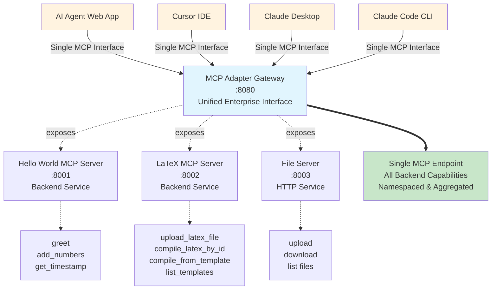

# MCP Adapter

[](https://github.com/startakovsky/mcp-adapter/actions/workflows/ci.yml)

**Enterprise MCP Gateway Architecture** - Production-ready solution that solves tool bloat, authentication complexity, and operational overhead in enterprise MCP deployments.

## Quick Start

### Demo Video

https://github.com/user-attachments/assets/50c6b0a1-82ea-4975-b4ff-64e3a6af56ac

### Setup Instructions

```bash
git clone https://github.com/startakovsky/mcp-adapter.git
cd mcp-adapter
docker-compose up -d
mkdir limericks && cd limericks
npm install -g @anthropic-ai/claude-code
claude mcp add -t http mcp_adapter http://localhost:8080 -s project
claude
```

Try: "Create a PDF limerick about MCP gateways and give me the download link."

This creates a `.mcp.json` file in your project with the MCP Adapter configuration. The `.mcp.json` format is Claude Code's standard configuration for project-scoped MCP servers, designed to be checked into version control for team collaboration.

## The Enterprise MCP Problem

Traditional MCP deployments create operational complexity through:

- **Tool Bloat** - Every application maintains its own tool sets, leading to duplication and inconsistency
- **Authentication Complexity** - Each MCP server handles its own auth, creating fragmented security policies
- **N×M Integration Problem** - M applications × N tools = exponential integration overhead where each application needs custom auth, error handling, and maintenance for every tool connection
- **No Centralized Control** - Distributed authorization decisions with no unified monitoring or session management
- **Operational Overhead** - Complex multi-tenant resource isolation with scaling challenges

## The Gateway Solution

MCP Adapter transforms the **N×M integration problem into M+N standardized connections** through enterprise gateway architecture, where M applications and N tools connect through a single gateway rather than requiring M×N individual connections:

✅ **Centralized Authentication** - Single OAuth 2.1 endpoint for all MCP services  
✅ **Unified Authorization Matrix** - Three-dimensional tenant×client×resource mapping  
✅ **Gateway-Managed Connections** - Session pooling and routing at the perimeter  
✅ **MCP Servers Focus on Domain Logic** - Backend servers act as pure resource providers  

```
+------------------+ +-----------+ +-------------------+
| MCP Client       | <-> | Gateway   | <-> | MCP Server        |
| (OAuth 2.1)      |     | (Authz)   |     | (Resource)        |
+------------------+ +-----------+ +-------------------+
 [<--------------Enterprise Gateway Architecture---------->]
```

**Current Implementation**: Production-ready MCP Adapter demonstrating enterprise gateway architecture with session management and security controls.

## Current Architecture



**Gateway Pattern Benefits**:
- **Tool Aggregation**: Single MCP interface exposing namespaced tools from multiple backends
- **Session Management**: Concurrent session pools with automatic load balancing
- **Service Mesh**: Isolated container networking with centralized routing
- **Monitoring**: Real-time session statistics and operational dashboards


## Available Tools

```json
{
  "name": "MCP Adapter",
  "version": "0.3.0", 
  "description": "Aggregates tools from multiple backend MCP servers",
  "connected_servers": "<dynamic_backend_discovery>",
  "available_tools": "<namespaced_tools_from_all_backends>",
  "tool_count": "<aggregated>",
  "server_count": "<backend_services>"
}
```

## Claude Code Integration

First, start the MCP Adapter network from the project root:

```bash
docker-compose up -d
```

Then add the MCP Adapter tools to Claude:

```bash
claude mcp add -s user -t http http://localhost:8080
```

## Documentation

- **[Technical Specification](TECHNICAL_SPECIFICATION.md)** - Complete guide to production MCP Adapter HTTP gateways
- **[CLAUDE.md](CLAUDE.md)** - Development context and commands for Claude Code
- **[tests/CLAUDE.md](tests/CLAUDE.md)** - Comprehensive testing documentation

## Directory Structure

- `scripts/`: Developer tools and workflow scripts
- `tests/`: All test code and test utilities
- `latex-server/`, `hello-world/`, `gateway/`: Service implementations

## Enterprise-Grade Security & Features

**Production-Ready Security Architecture**:
- **OAuth 2.1 Integration** - Complete OAuth flow with PKCE and token validation
- **Session Management** - Stateless HTTP with secure session pooling and automatic cleanup
- **Input Validation** - Comprehensive sanitization preventing injection attacks
- **Path Traversal Protection** - Blocks directory escape attempts (`../../../etc/passwd` → sanitized)
- **File Injection Defense** - Validates uploads and prevents system file access
- **Docker Isolation** - Service mesh networking with container-level security
- **Security Testing** - 192 tests covering real attack vectors and defensive measures

**Gateway Architecture Benefits**:
- **Centralized Authentication** - Single OAuth endpoint eliminates auth complexity
- **Tool Consolidation** - Eliminates tool bloat by providing unified access to all backend capabilities
- **Unified Authorization** - Three-dimensional tenant×client×resource mapping with RBAC foundation
- **High Availability** - Fault-tolerant design with circuit breaker patterns
- **Session Pooling** - Concurrent session management with automatic load balancing
- **Tool Aggregation** - Namespace-aware discovery and routing across backend servers
- **Service Discovery** - Dynamic backend registration with health monitoring

**Enterprise Readiness**:
- **RBAC Foundation** - Role-based access control framework ready for multi-tenant deployment
- **Monitoring & Observability** - Structured logging, metrics, and session analytics
- **Scalable Design** - Stateless operation supporting horizontal scaling patterns
- **Configuration Management** - Environment-based configuration with Docker Compose
- **Operational Excellence** - User-friendly URLs, collision-free file management, clean downloads

## Production Gateway Architecture

MCP Adapter demonstrates enterprise gateway patterns that solve tool bloat, authentication complexity, and operational overhead:

**Gateway Server**: Central aggregation point that transforms N×M complexity into M+N standardized connections  
**Backend MCP Servers**: Pure resource providers focusing on domain logic (hello-world, latex-server)  
**Service Mesh**: Isolated container networking with centralized routing and discovery  
**Session Management**: Concurrent session pools with automatic load balancing and failover

**Implementation Highlights**:
- **Multi-server aggregation** with namespace prefixing and unified tool discovery
- **Concurrent session pools** with automatic allocation and load balancing
- **Real-time monitoring** at `/sessions` endpoint with session statistics
- **Emergency scaling** capability to exceed pool limits under high load

For detailed architecture patterns and deployment strategies, see [Technical Specification](TECHNICAL_SPECIFICATION.md).

### Container Registry

All service images are automatically built and published to GitHub Container Registry (GHCR):

```bash
# Available images
ghcr.io/startakovsky/mcp-adapter/gateway:latest
ghcr.io/startakovsky/mcp-adapter/hello-world:latest  
ghcr.io/startakovsky/mcp-adapter/latex-server:latest
ghcr.io/startakovsky/mcp-adapter/file-server:latest

# Version-specific tags also available
ghcr.io/startakovsky/mcp-adapter/gateway:sha-1234567
```

**Production Deployment**: Images are automatically built and tested via CI/CD pipeline on every push to `main`.


## Roadmap

**Phase 1: Multi-Tenant Architecture** (Q2 2025)
- **Tenant-Scoped Authentication** - OAuth 2.1 with tenant membership controls
- **Three-Dimensional Authorization** - Tenant×client×resource mapping compliance
- **Tenant-Bounded Resource Discovery** - Isolated tool visibility per tenant
- **Federated Registry Support** - Cross-tenant tool sharing with governance

**Phase 2: Administrative Controls** (Q3 2025)
- **Administrative Panel** - Web-based tenant and policy management
- **Role-Based Access Control (RBAC)** - Fine-grained permissions framework
- **Usage Analytics** - Per-tenant metrics and audit logging
- **Policy Management** - Centralized authorization rule configuration

**Phase 3: Enterprise Platform** (Q4 2025)
- **Hierarchical Authentication** - Multi-level tenant organization
- **Semantic Tool Discovery** - AI-powered tool matching within tenant boundaries
- **Performance Optimization** - Advanced caching and connection pooling
- **Compliance Framework** - SOC 2, GDPR, and enterprise audit support

## Development

See [CLAUDE.md](CLAUDE.md) for complete development commands and workflow.
